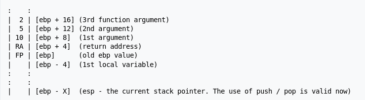

### FAQ

1. [Why kernel code/thread executing in interrupt context cannot sleep](https://stackoverflow.com/questions/1053572/why-kernel-code-thread-executing-in-interrupt-context-cannot-sleep)?

> You cannot sleep in an interrupt handler because interrupts do not have a backing process context, and thus there is nothing to reschedule back into. In other words, interrupt hanlers are not associated with a task, so there is nothing to "put to sleep" and (more importanly) "nothing to wake up"

2. [What does Pre-Emption mean in computer](https://www.techopedia.com/definition/27086/pre-emption)?

> Pre-emption refers to the temporary interruption and suspension of a task, without asking for its cooperation, with the intention to resume that task later. This act is called a context switch and is typically performed by the pre-emptive scheduler, a component in the oeprating system authorized to preempt, or interrupt, and later resume tasks running in the system.

3. [Does each process have its own kernel stack](https://stackoverflow.com/questions/12911841/kernel-stack-and-user-space-stack)?

> Not just each process - each _thread_ has its own stack (and, in fact, its own user stack as well)

4. [What's the size of kernel stack](https://stackoverflow.com/questions/12911841/kernel-stack-and-user-space-stack)?

> Generally, it's 8KB on 32-bit architectures and 16KB on 64-bit architectures.

5. [Why call `preempt_disable()` in spinlock](https://blog.csdn.net/kasalyn/article/details/11473885)?

Assume preemption is allowed. If a new task whose priority is higher than the current task comes, preemption will occur. And if this preempting task requires the same spinlock before the previous one release it, it be busy wait the previous one to release it. However, the former one can never be rescheduled as there exists a running task with a higher priority. That is, dealock happens. Thus `preempt_disable()` is neccessary.

6. [Why can't sleep between `spin_lock()` and `spin_unlock`](https://nanxiao.me/linux-kernel-note-52-use-spinlock-process-cant-be-preempted/)?

If current task sleeps in critical section, a new task will be chosen. And if this new one has a higher priority and it requires the same spinlock, then it will be busy wait forever as it will never free cpu voluntarily before it gets the spinlock in non-preempted kernel or the previous task will never be rescheduled to release spinlock as there exists a running task with higher priority in preempted kernel.

By the way, it's true even the chosen task requires the same spinlock has a lower priority. Based on question 5, `preempt_diable()` is called. Then the former task will have no opportunity to release the spinlock and the new task will be busy wait forever.

7. What's the differences between preempt_diable and irq_disable?

8. What's the differences between trapframe and context?

9. [What things can not do in interrupt context](http://www.embeddedlinux.org.cn/essentiallinuxdevicedrivers/final/ch02lev1sec3.html)?

* Go to sleep or relinquish the processor;
* Acquire a mutex;
* Perform time-consuming tasks;
* Access user space virtual memroy (why?);

10. [What is interrupt handling](http://www.embeddedlinux.org.cn/essentiallinuxdevicedrivers/final/ch04lev1sec2.html#ch04lev1sec2)?

> Each interrupting device is assigned an associated identifier called an _interrupt request_ (IRQ) number.
> When the processor detects that an interrupt has been generated on an IRQ, it abruptly stops what it's doing and invokes an _interrupt service routine_ (ISR) registered for the corresponding IRQ.
> _Interrupt handlers_ execute in interrupt context.

11. [What are IR, PC, SP, AC](https://www.ques10.com/p/8532/explain-role-of-different-registers-like-ir-pc-sp-/)?

* The Instruction Register (IR) is used to hold the instruction that is currently beging executed;
* The Program Counter (PC) holds the address of the next instruction to be executed, while IR holds the encoeds instruction. [This question](https://stackoverflow.com/questions/15739489/program-counter-and-instruction-register) expalains why we need them both;
* The Stack Pointer (SP) is used to point to the top activation record on the run-time stack.
* AC is specifically used to 'accumulate' the result of the currently running instructions;

12. [What are vmlinux, vilinux.bin, vmlinuz, zImage and bzImage](https://unix.stackexchange.com/questions/5518/what-is-the-difference-between-the-following-kernel-makefile-terms-vmlinux-vml)?

* __vmlinux__ is the linux kernel in a statically executable file format which is nothing but the uncompressed version of kernel image which can be used for debugging.
* __vmlinux.bin__ is the same as vmlinux, but in a bootable raw binary file format. All symbols and relocation information is dicarded. Generated from vmlinux by `objcopy -O binary vmlinux vimlinux.bin`.
* __vmlinuz__ is vmlinux file compressed with `zlib`.
* __zImage__ (make zImage) is the old format for small kernels (compressed, below 512K). At boot, this iamge gets loaded low in memroy (the first 640KB of the RAM).
* __bzImage__ (make bzImage) was created while the kerenel grew handles bigger images (compressed, over 512KB). The image gets loaded high in memroy (above 1MB RAM).

13. How do ebp and esp work?

This [page](https://en.wikibooks.org/wiki/X86_Disassembly/Functions_and_Stack_Frames) gives a good explanation. The main content is copied as bellow:

In the execution environment, functions are frequently set up with a "__stack frame__" to allow access to both function parameters, and automatic function variables.
When a function is called, a new stack frame is created at the current __esp__ location. A stack frame acts like a partition on the stack.

The Standard Entry Sequence is the following piece of code (X is the total size, in bytes, of all automatic variables used in the function):
```masm
push ebp
mov ebp, esp
sub esp, X
```
For example, here is a C function code fragment and the resulting assembly instructions:
```C
void MyFunction(void)
{
    int a, b, c;
}
```
```masm
_MyFunction:
    push ebp      ; save the value of ebp
    mov ebp, esp  ; ebp now points to the top of the stack
    sub esp, 12   ; space allocated on the stack for the local variables
```
For function with parameters:
```C
MyFunction2(10, 5, 2);
```
This will create the following assembly code:
```masm
push 2
push 5
push 10
call _MyFunction2
```
Remember that the __call__ x86 instruction is basically equivalent to
```masm
push eip +2 ; return address is current address + size of two instructions
jmp _MyFunction2
```
and pushing basically does this:
```masm
sub esp, 4   ; "allocate" space for the new stack item
mov [esp], X ; put new stack item value X in
```
Here is a (crude) representation of the stack at this point:


The Standard Exit Sequence must undo the things that the Standard Entry Sequence does. Thus, it must perform the following tasks, in the following order:
    1. Remove space for local variables, by reverting __esp__ to its old value.
    2. Restore the old value of __ebp__ to its old value, which is on top the stack.
    3. Return to the calling function with a _ret_ command.

As an example, the following C code:
```C
void MyFunction3(int x, int y, int z)
{
    int a, b, c;
    ...
    return;
}
```
Will create the following assembly code:
```masm
_MyFunction3:
    push ebp
    mov ebp, esp
    sub esp, 12   ; sizeof(a) + sizeof(b) + sizeof(c)
    ; x = [ebp + 8], y = [ebp + 12], z= [ebp + 16]
    ; a = [ebp - 4] = [esp + 8], b = [ebp - 8] = [esp + 4], c = [ebp - 12] = [esp]
    mov esp, ebp
    pop ebp
    ret 12 ; sizeof(a) + sizeof(b) + sizeof(c)
```

14. [What's the difference betweeen ia64 and x64](http://www.differencebetween.net/technology/difference-between-ia64-and-x64/)?

> 1. IA64 refers to the 64 bit Itanium architecture while x64 is the 64 bit extension to the x86 architecture
> 2. The IA64 is exclusive to Intel while x64 is used by all
> 3. IA64 was intended for high-end server applications while x64 was initially intended for desktops but were scaled up
> 4. IA64 systems are not able to run old x86 applications while most x64 systems are
> 5. IA64 is very slow to adopt new computer technologies while x64 is very fast
> 6. IA64 would no longer be supported by newer versions of Microsoft Windows while the x64 would still be supported
