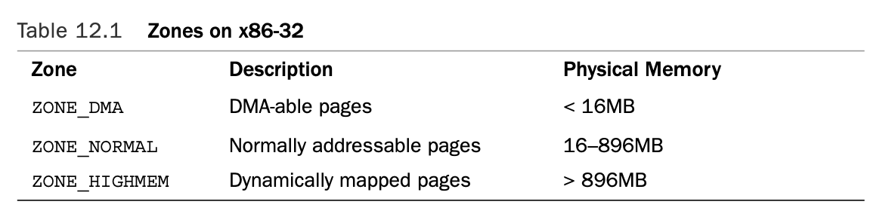

#### Website List
[kernel.org](https://www.kernel.org/doc/html/v4.16/index.html)

### Memory Management
#### Pages

> Most 32-bit architecutres have 4KB pages, whereas most 64-bit architectures have 8KB pages.
> `page` structure is associated with physical pages, not virtual pages. The data structure's goal is to describe physical memeory, not the data contained therein.

#### Zones

> Because of harware limitations, the kernel cannot treat all pages as identical. The kernel uses the zones to group pages of similar properties.
> The zones do not have any physical relevance but are simply logical groupings used by the kernel to keep track of pages.
> The kerenl has to deal with two shortcomings of hareware with respect to memroy addressing:
> * Some hareware devices can perform DMA (direct memroy access) to only certain memory address.
> * Some architectures can physically addressing larger amounts of memory than they can virtually address. Consequently, some memory is not permanently mapped into the kernel address space.
> 
> To cope above problems, Linux has four primary memory zones:
> * __ZONE_DMA__ - This zone contains pages that can undergo DMA.
> * __ZONE_DMA32__ - Like ZONE_DMA, this zone contains pages that can undergo DMA. Unlke __ZONE_DMA__, these pages are accessible only by 32-bit devices.
> * __ZONE_NORMAL__ - This zone contains normal, regularly mapped, pages.
> * __ZONE_HIGHMEM__ - This zone contains "high memory", which are pages not permanently mapped into the kernel's address space.
> 
> The zones on a x86 architecture are listed as follows. 
> 
> For x64 architecutre, it can fully map and handle 64-bits of memory, thus, x64 has no ZONE_HIGHMEM.
> 

#### Getting Pages
Flag | Description
-------|-----------------
`alloc_page(gfp_mask)` | Allocates a single and returns a pointer to its `page` structure
`alloc_pages(gfp_mask, order)` | Allocate $2^{order}$ pages and return a ponter to the first page's `page` structure 
`__get_free_page(gfp_mask)` | Allocate a single page and returns a pointer to is logical address
`__get_free_pages(gfp_mask, order)` | Allocates $2^{order}$ pages and returns a pointer to the first page's logical address 

#### gfp_mask Flags
> _gfp_ stands for `__get_free_pages()`.
> The flags are broken up into three categories: action modifiers, zone modifiers, and types. Action modifiers specify _how_ the kernel is supposed to allocate the requested memory. Zone modifiers specify from _where_ to allocate memory. Type flags specify a combination of action and zone modifiers as needed by a certain _type_ of memory allocation.

#### Others

1. MMU

> the memory management unit (MMU) that do the translation from virtual to physical address typically deals in page.
> 

##### Reference
https://www.kernel.org/doc/html/v4.16/process/howto.html