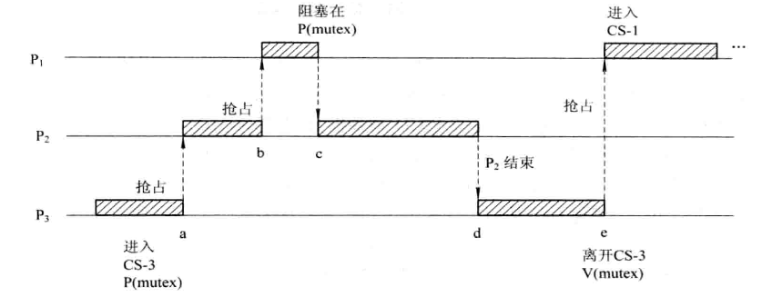

# Mutex's Mechanism and Implementation

## Introduction

```c
struct mutex {
        atomic_long_t           owner;
        raw_spinlock_t          wait_lock;
#ifdef CONFIG_MUTEX_SPIN_ON_OWNER
        struct optimistic_spin_queue osq; /* Spinner MCS lock */
#endif    
        struct list_head        wait_list;
#ifdef CONFIG_DEBUG_MUTEXES
        void                    *magic;
#endif
#ifdef CONFIG_DEBUG_LOCK_ALLOC
        struct lockdep_map      dep_map;
#endif
};
```

## The priority inversion problem



假设存在三个独立的线程P1，P2和P3，优先级满足P1 > P2 > P3，并且P1和P3共享一个通过mutex保护的资源。

某时刻，P3得到调度执行，在执行**P(mutex)**操作后进入临界区_CS-3_。时刻a，P2就绪，因为优先级高于P3，因此P2抢占P3运行。时刻b，P1就绪，因为优先级高于P2，因此抢占P2接着运行。时刻c，P1尝试执行**P(mutex)**进入临界区_CS-1_，但因为此时mutex在P3手上，因此P1阻塞，调度器选择此时优先级最高的任务P2继续执行。时刻d，P2执行完，在P2执行完后，调度器接着选择此时优先级最高的任务P3执行。e时刻，P3执行**V(mutex)**操作退出临界区，并唤醒P1，此时P1抢占P3执行，得以进入_CS-1_。后面的预期行为是P1完成剩余任务，然后P3得到调度直到执行完。

可以看到整个过程中，任务执行完成的顺序为P2 > P1 > P3，而根据优先级原则，高优先级的任务应当先执行，预期的执行顺序应该是P1> P2 > P3，因此出现了**priority inversion problem**。