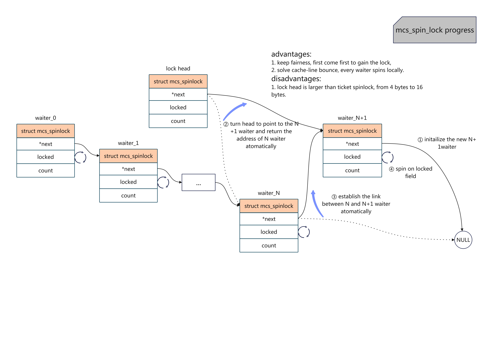

[TOC]

# spinlock

## Introduction
## The evoluation of the implementation of spinlock

spinlock在同步机制中相对比较简单，但是也经历过多次迭代，从而逐步提升其性能。主要的阶段可以归纳如下：

| Stage            | Implementation                                               | Adavantages and Disadvantages                                |
| ---------------- | ------------------------------------------------------------ | ------------------------------------------------------------ |
| 单整型变量的自旋 | 基于Compare and Swap、Test and Set等原子指令                 | 1. 实现简单，2. 不保证公平性，先到并不一定先获得，3. 存在cache-line bounce问题。 |
| ticket spinlocks | 队列化，类似银行柜台叫号，只有柜台号码与客户号码一致时才被服务 | 1. 解决公平性问题，2. 存在cache-line bounce问题。            |
| MCS locks        | 本地化，实现上是单链表，自旋于本地变量                       | 1. 解决cache-line bounce问题，2. 但“锁头”结构体增大，相比ticket spinlocks，从4字节增加到16字节。 |
| qspinlocks       | 基于MCS locks，压缩队尾节点信息，保持锁头大小为4字节         | 1. 解决“锁头”增大问题，2. 对少竞争场景并不建立MCS队列。      |
| pvqspinlocks     | 针对虚拟化场景，本文暂不涉及                                 | -                                                            |
| ...              | ...                                                          | ...                                                          |

这里“锁头”指的是暴露给使用者的锁的结构体部分，即**arch_spinlock_t**部分。

### Spin on an integer

思路比较简单，需要进入临界区的线程，在一个原子操作中，完成检查整型变量是否是解锁状态，如果是，则将整型变量修改为解锁状态，如果不是，则重新开始检查过程。

当前硬件上支持的主要有两种，一种是基于Compare and Swap操作，另一种是基于Test and Set操作。

#### What is Compare and Swap?
`cas`是compare and swap的缩写，根据[wikipedia](https://en.wikipedia.org/wiki/Compare-and-swap)上的定义：

> It compares the contents of a memory location with a given value and, only if they are the same, modifies the contents of that memory location to a new given value. This is done as a single atomic operation.

它的作用是比较给定的某个内存地址上的值与给定值是否相等，只有在相等的时候，将新值保存在该内存地址上，整个过程是一个原子操作。它常常用在多线程环境，用来实现同步。另外，它也有两种方式来判断是否成功执行了替换：

* 使用true或者false返回值，可以使用形如以下[伪代码](https://en.wikipedia.org/wiki/Compare-and-swap)来表示：
```pseudocode
function cas(p: pointer to int, old: int, new: int) is
    if *p ≠ old
        return false

    *p ← new

    return true
```

* 返回old值，形如以下伪代码：
```pseudocode
function cas(p: pointer to int, old: int, new: int) is
    ret: int ← old
    if *p = old
        *p ← new

    return ret
```

另外，也有将_p_的old值放入_old_变量中进行返回的情形，目的是相同的。

#### The implementation on sh platform

当前Linux内核中，只有[SuperH](https://en.wikipedia.org/wiki/SuperH)芯片平台上的spinlock是使用该方式实现的，它的加锁/解锁过程代码如下：

```c
// arch/sh/include/asm/spinlock-cas.h
static inline void arch_spin_lock(arch_spinlock_t *lock)
{
        while (!__sl_cas(&lock->lock, 1, 0));
}

static inline void arch_spin_unlock(arch_spinlock_t *lock)
{
        __sl_cas(&lock->lock, 0, 1);
}
```

可以看到都是基于`__sl_cas`函数，而它的实现如下：

```c
// arch/sh/include/asm/spinlock-cas.h
static inline unsigned __sl_cas(volatile unsigned *p, unsigned old, unsigned new)
{
        __asm__ __volatile__("cas.l %1,%0,@r0"
                : "+r"(new)
                : "r"(old), "z"(p)
                : "t", "memory" );
        return new;
}
```

查阅[Inline Assembly Language in C code](https://gcc.gnu.org/onlinedocs/gcc/extensions-to-the-c-language-family/how-to-use-inline-assembly-language-in-c-code.html)可知，整个函数只有一条汇编语句`cas.l %1, %0, @r0`，_%0_对应_new_，_%1_对应_old_，_%2_对应_p_。根据[J-core](https://lists.j-core.org/pipermail/j-core/2016-August/000346.html)论坛上的解释：

> There is an atomic compare-and-swap instruction cas.l Rm,Rn, at R0 that
>   compares the value at address R0 with Rm and, if equal, stores the
>   value Rn. Either way, afterwards Rn contains the old value that was
>   read. The T flag is also set to indicate success/failure (I believe
>   T=1 on success but I'd have to check)

它执行的是将**R0**寄存器（函数传参的第一个参数，也就是_p_）指向地址上的值与_old_比较，如果相等，则将R_new_填入_p_指向的地址上。另外，无论是否执行替换，__new_中都保存的是_p_指向地址上的旧值（对应前述第二种判断是否替换的方式），这正是`cas`指令的定义。

基于以上的理解，我们回头看`arch_spin_lock`表示的意义：

当_lock->lock_中的值等于1时，将0填入_lock->lock_，并返回1，`arch_spin_lock`跳出while循环并返回，表示加锁成功。当_lock->lock_中的值不等于1时（那么必然为0），则不修改_lock->lock_值，并返回0，`arch_spin_lock`继续while死循环，表示等锁。

而`arch_spin_unlock`表示的意义：

当_lock->lock_中的值等于0时，将1填入_lock->lock_，并返回0，`arch_spin_unlock`返回，表示解锁成功。当_lock->lock_中的值等于1时，则直接返回1，`arch_spin_unlock`返回，无事发生，符合对处于解锁状态的spinlock再执行解锁时的预期。

#### What is Test and Set?

略，详见[Test and Set](https://en.wikipedia.org/wiki/Test-and-set)，Windows的`xchg`指令也是这一用途，请参考[spinlock](https://en.wikipedia.org/wiki/Spinlock)给出的x86上的例子：

```assembly
; Intel syntax

locked:                      ; The lock variable. 1 = locked, 0 = unlocked.
     dd      0

spin_lock:
     mov     eax, 1          ; Set the EAX register to 1.
     xchg    eax, [locked]   ; Atomically swap the EAX register with
                             ;  the lock variable.
                             ; This will always store 1 to the lock, leaving
                             ;  the previous value in the EAX register.
     test    eax, eax        ; Test EAX with itself. Among other things, this will
                             ;  set the processor's Zero Flag if EAX is 0.
                             ; If EAX is 0, then the lock was unlocked and
                             ;  we just locked it.
                             ; Otherwise, EAX is 1 and we didn't acquire the lock.
     jnz     spin_lock       ; Jump back to the MOV instruction if the Zero Flag is
                             ;  not set; the lock was previously locked, and so
                             ; we need to spin until it becomes unlocked.
     ret                     ; The lock has been acquired, return to the calling
                             ;  function.

spin_unlock:
     xor     eax, eax        ; Set the EAX register to 0.
     xchg    eax, [locked]   ; Atomically swap the EAX register with
                             ;  the lock variable.
     ret                     ; The lock has been released.
```

#### Advantages and Disadvantages

显然，该方式非常简单，容易理解。但是它也有两个比较大的缺陷：

1. 不保证公平性，所有参与自旋的线程谁先将公共变量置为加锁状态谁得到锁，而非谁先到先获取锁，极端情况可能出现长时间获取不到锁。
2. 存在cache-line bounce问题，高竞争下，因cache一致性性能大幅降低。

### ticket spinlock

为了解决公平性问题，核心思路是队列化。ticket spinlock采用了类似银行办理业务的做法，每个客户先获取一个号码，号码保证唯一性，当客户持有的号码与柜台正在服务的号码相等时，该客户才得以开始办理自己的业务。

当前在armv6平台上，是ticket spinlock的实现。
#### The definition of `arch_spinlock_t`

```c
// arch/arm/include/asm/spinlock_types.h

#define TICKET_SHIFT    16

typedef struct {
        union {
                u32 slock;
                struct __raw_tickets {
#ifdef __ARMEB__
                        u16 next;
                        u16 owner;
#else
                        u16 owner;
                        u16 next;
#endif
                } tickets;
        };
} arch_spinlock_t;
```

可以看到它把4字节的_slock_分成了2字节的_next_和2字节的_owner_域，上述的**\_\_ARMEB\_\_**表示ARM EABI Big-endian，表示大端字节序，详情参考该[解答](https://www.oschina.net/question/565065_113329)。

#### The lock operation

```c
// arch/arm/include/asm/spinlock.h
static inline void arch_spin_lock(arch_spinlock_t *lock)
{
        unsigned long tmp;
        u32 newval;
        arch_spinlock_t lockval;

        prefetchw(&lock->slock); // 预取到cache中
        /* part 1 */
        __asm__ __volatile__(
"1:     ldrex   %0, [%3]\n"
"       add     %1, %0, %4\n"
"       strex   %2, %1, [%3]\n"
"       teq     %2, #0\n"
"       bne     1b"
        : "=&r" (lockval), "=&r" (newval), "=&r" (tmp)
        : "r" (&lock->slock), "I" (1 << TICKET_SHIFT)
        : "cc");

        /* part 2 */
        while (lockval.tickets.next != lockval.tickets.owner) {
                wfe(); // 用于降低busy wait的时候的功耗
                lockval.tickets.owner = READ_ONCE(lock->tickets.owner);
        }

        smp_mb();
}
```

相比前一种方式要复杂很多，它的主要部分可以分成2部分，

* 嵌入式汇编部分（part 1），主要是“原子地”将当前共享的_lock_保存到局部变量_lockval_中，并对_lock->tickets.next_加一，类比于将当前号码给新来的客户，并生成新号码等待下一位客户。
* while循环部分（part 2），主要是不断比较共享的_lock->tickets.owner_与局部变量_lockval.tickets.owner_是否一样，直到相等为止，类比于检查正在服务的号码是否跟自己持有的号码一致，如果不一样则继续检查。

这里，共享变量中_lock->tickets.owner_充当的是正在服务的号码，_lock->tickets.next_充当的是下一个新号码，本地变量中_lockval.tickets.owner_的用途是同步正在服务的号码，_lockval.tickets.next_充当的是客户持有的号码。

另外，下面是对于part 1的嵌入式汇编的补充信息，解释为何代表的是上述意思，不感兴趣的可以跳过该部分。我们来仔细看看以下5句汇编语句：

```c
        __asm__ __volatile__(
"1:     ldrex   %0, [%3]\n"
"       add     %1, %0, %4\n"
"       strex   %2, %1, [%3]\n"
"       teq     %2, #0\n"
"       bne     1b"
        : "=&r" (lockval), "=&r" (newval), "=&r" (tmp)
        : "r" (&lock->slock), "I" (1 << TICKET_SHIFT)
        : "cc");
```

根据嵌入式汇编语法，%0 -> _lockval_，%1 -> _newval_，%2 -> _tmp_，%3 -> _&lock->slock_，%4 -> _1 << TICKET_SHIFT_。**ldrex**和**strex**指令分别是**ldr**和**str**指令的exclusive模式。该模式下，例如cpu A，在执行`LDREX R1, [R0]`时会将_R0_设置成exclusive monitor状态（个人理解标记了当前cpu）。如果在执行`STREX R2, R1, [R0]`时，仍然是cpu A独占的话，则会将_R1_的值保存到_R0_代表的地址上，并返回0保存在_R2_（表示成功），如果不是cpu A独占，例如cpu B也执行了`LDREX R1, [R0]`命令，此时会是cpu B独占状态，则cpu A的`STREX R2, R1, [R0]`命令失败，返回1保存在R2（表示失败），详细请阅读[arm developer](https://developer.arm.com/documentation/dht0008/a/ch01s02s01)，命令的关键解释如下：

> The LDREX instruction loads a word from memory, initializing the state of theexclusive monitor(s) to track the synchronization operation.
>
> The STREX instruction performs a conditional store of a word to memory. If theexclusive monitor(s) permit the store, the operation updates the memory location andreturns the value 0 in the destination register, indicating that the operation succeeded.If the exclusive monitor(s) do not permit the store, the operation does not update thememory location and returns the value 1 in the destination register.

基于以上补充信息，我们可以看出每句的汇编意思是，

* 第1行，将_lock->slock_的值拷贝到局部变量_lockval_中，即`lockval = lock->slock`,并设置exclusive monitor状态，
* 第2行，将_lockval_加1 << 16保存到_newval_中，1<<16对应next域加1，也即`newval.tickets.next= lockval.tickets.next + 1`，
* 第3行，尝试将_newval_写回_lock->slock_，如果仍然是自己独占，则执行成功，并将0写入_tmp_，如果不是自己独占，则不执行写回，将1写入_tmp_，即`lock->slock = newval ? 0 : 1`，
* 第4行，检验_tmp_的值是否0，
* 第5行，如果不相等，则跳转到最近的“1”标签，方向是backward，即第一行，重试整个过程。

R结合起来即“原子地”将当前共享的_lock_保存到局部变量_lockval_中，并对_lock->tickets.next_加一。

#### The unlock operation

```c
// arch/arm/include/asm/spinlock.h
static inline void arch_spin_unlock(arch_spinlock_t *lock)
{
        smp_mb();
        lock->tickets.owner++;
        dsb_sev();
}
```

解锁过程就比较简单了，即将正在服务的号码_lock->tickets.owner_更新到下一个即可。

#### Advantages and Disadvantages

通过队列化，我们解决了公平性问题，但是因为所有等待者仍然在轮询共享变量_lock->slock_，存在cache-line bounce问题，下一小节，我们看是linux社区是如何解决该问题的。

### MCS locks

解决cache-line bounce问题的核心思路是本地化，每一个申请者轮询局部变量，使用本地cache，从而避免轮询共享的变量。

#### What is cache-line bounce?

在说明MCS locks实现前，我们首先需要明白什么是cache-line bounce。从[quora](https://www.quora.com/What-is-cache-line-bouncing-How-may-a-spinlock-trigger-this-frequently)上的回答可以看到，当cpu访问数据的时候，需要先从memory中将数据加载到自己的cache中，然后再从cache中读取数据。当访问共享的数据时，例如A和B两个cpu分别将某个共享数据加入自己的L1 cache，当A修改该数据时，此时会做cache一致性操作，将该数据写回memory，然后再同步到cpu B的L1 cache，整个过程中，我们可以看到共享数据在不同cpu的cache-line上“弹来弹去”，这正是cache-line bounce名字的来历。我们知道从memory中读写数据是比较慢的，而从cache中读写数据比较快，因此，发生cache-line bounce时会导致性能下降。另外，如果访问共享数据的cpu比较多的时候，每一次数据修改都需要同步给所有的核，性能会进一步恶化。

具体到spinlock场景下，锁是被不同申请者访问的，共享必定存在，似乎cache-line bounce在所难免，但是是不是每一次修改都需要同步给所有申请者呢？仔细分析后可以发现，其实任意时刻只有一个cpu可以持有、释放或者获取锁，这意味着我们对锁做出的任何修改，只用同步给下一个获得者即可，而其他的等待着可以自旋于自己的局部变量，这正是MCS locks的做法。

#### The definition of `struct mcs_spinlock`

当前linux内核中并没有MCS locks的完整实现，只保留了加锁**mcs_spin_lock**和解锁**mcs_spin_unlock**两个接口是存在的，通过其代码和相关注释：

> In order to acquire the lock, the caller should declare a local node and pass a reference of the node to this function in addition to the lock.

我们可以看出，它的“锁头”也是一个`struct mcs_spinlock`结构体，定义如下所示：

```c
// kernel/locking/mcs_spinlock.h
struct mcs_spinlock {
        struct mcs_spinlock *next;
        int locked; /* 1 if lock acquired */
        int count;  /* nesting count, see qspinlock.c */
};
```

可以看出，它就是常见的单链表形式，MCS locks正是通过单链表建立起队列，从而保证了公平性，每个申请者都有一个自己的本地节点，等待时自旋于节点本地的_locked_，从而解决cache-line bounce问题。

#### The lock operation

```c
static inline
void mcs_spin_lock(struct mcs_spinlock **lock, struct mcs_spinlock *node)
{
        struct mcs_spinlock *prev;

        /* step 1 */
        node->locked = 0;
        node->next   = NULL;

        /* step 2 */
        prev = xchg(lock, node);
        // special case, we are the first one to apply the lock
        if (likely(prev == NULL)) {
                return;
        }
        /* step 3 */
        WRITE_ONCE(prev->next, node);

        /* step 4 */
        arch_mcs_spin_lock_contended(&node->locked);
}
```

以上是加锁的实现，整个过程可以用以下流程图表示：



#### The unlock operation

### qspinlocks

### more ...
## History

| Date       | Adance                 |
| ---------- | ---------------------- |
| 2023/10/03 | 完成基于`cas`指令小节  |
| 2023/10/04 | 补充test and set内容   |
| 2023/10/05 | 补充spinlock演进的概要 |
| 2023/10/06 | 补充ticket locks小节   |
