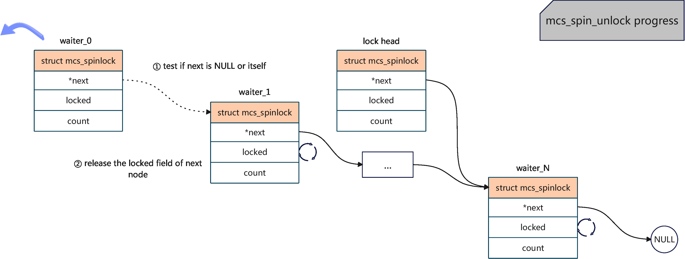
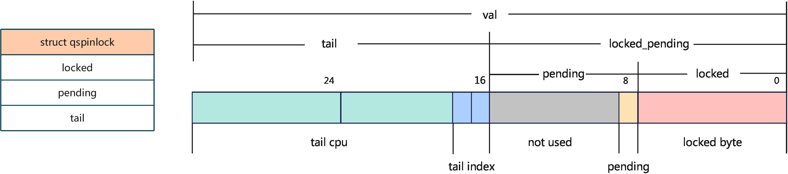
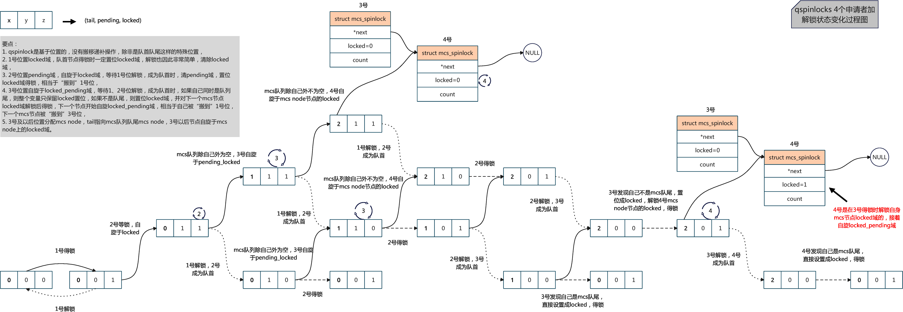

[TOC]

# Spinlock's Mechanism and Implementation

## Introduction

以下摘自[蜗窝科技](http://www.wowotech.net/kernel_synchronization/spinlock.html)，是对spinlock特点的很好总结：

> （1）spin lock是一种死等的锁机制。当发生访问资源冲突的时候，可以有两个选择：一个是死等，一个是挂起当前进程，调度其他进程执行。spin lock是一种死等的机制，当前的执行thread会不断的重新尝试直到获取锁进入临界区。
>
> （2）只允许一个thread进入。semaphore可以允许多个thread进入，spin lock不行，一次只能有一个thread获取锁并进入临界区，其他的thread都是在门口不断的尝试。
>
> （3）执行时间短。由于spin lock死等这种特性，因此它使用在那些代码不是非常复杂的临界区（当然也不能太简单，否则使用原子操作或者其他适用简单场景的同步机制就OK了），如果临界区执行时间太长，那么不断在临界区门口“死等”的那些thread是多么的浪费CPU啊（当然，现代CPU的设计都会考虑同步原语的实现，例如ARM提供了WFE和SEV这样的类似指令，避免CPU进入busy loop的悲惨境地）
>
> （4）可以在中断上下文执行。由于不睡眠，因此spin lock可以在中断上下文中适用。

## The interface of spinlock

### The API interfaces

以下摘自[蜗窝科技](http://www.wowotech.net/kernel_synchronization/spinlock.html)：

| 接口API的类型                                                | spinlock中的定义     | raw_spinlock的定义       |
| ------------------------------------------------------------ | -------------------- | ------------------------ |
| 定义spin lock并初始化                                        | DEFINE_SPINLOCK      | DEFINE_RAW_SPINLOCK      |
| 动态初始化spin lock                                          | spin_lock_init       | raw_spin_lock_init       |
| 获取指定的spin lock                                          | spin_lock            | raw_spin_lock            |
| 获取指定的spin lock同时disable本CPU中断                      | spin_lock_irq        | raw_spin_lock_irq        |
| 保存本CPU当前的irq状态，disable本CPU中断并获取指定的spin lock | spin_lock_irqsave    | raw_spin_lock_irqsave    |
| 获取指定的spin lock同时disable本CPU的bottom half             | spin_lock_bh         | raw_spin_lock_bh         |
| 释放指定的spin lock                                          | spin_unlock          | raw_spin_unlock          |
| 释放指定的spin lock同时enable本CPU中断                       | spin_unlock_irq      | raw_spin_unock_irq       |
| 释放指定的spin lock同时恢复本CPU的中断状态                   | spin_unlock_irqstore | raw_spin_unlock_irqstore |
| 获取指定的spin lock同时enable本CPU的bottom half              | spin_unlock_bh       | raw_spin_unlock_bh       |
| 尝试去获取spin lock，如果失败，不会spin，而是返回非零值      | spin_trylock         | raw_spin_trylock         |
| 判断spin lock是否是locked，如果其他的thread已经获取了该lock，那么返回非零值，否则返回0 | spin_is_locked       | raw_spin_is_locked       |

#### The struct hierachy

```c
// include/linux/spinlock_types.h
typedef struct spinlock {
        union {
                struct raw_spinlock rlock;
                ...
        };
} spinlock_t;

// include/linux/spinlock_types_raw.h
typedef struct raw_spinlock {
        arch_spinlock_t raw_lock;
#ifdef CONFIG_DEBUG_SPINLOCK
        unsigned int magic, owner_cpu;
        void *owner;
#endif
#ifdef CONFIG_DEBUG_LOCK_ALLOC
        struct lockdep_map dep_map;
#endif
} raw_spinlock_t;
```

`spintlock_t` -> `struct raw_spinlock` -> `arch_spinlock_t`，处于核心的是依赖平台实现的`arch_spinlock_t`。

## The evoluation of the implementation of spinlock

spinlock在同步机制中比较基础，其实现经历过多次迭代，性能得到逐步提升，主要阶段可以归纳如下：

| Stage            | Implementation                                               | Adavantages and Disadvantages                                |
| ---------------- | ------------------------------------------------------------ | ------------------------------------------------------------ |
| 单整型变量的自旋 | 基于Compare and Swap、Test and Set等原子指令                 | 1. 实现简单，2. 不保证公平性，即先到并不一定先获得，3. 存在cache-line bounce问题。 |
| ticket spinlocks | 队列化，类似银行柜台叫号，只有柜台号码与客户号码一致时才被服务 | 1. 解决公平性问题，2. 存在cache-line bounce问题。            |
| MCS locks        | 本地化，实现上是单链表，自旋于本地变量                       | 1. 在公平性基础上解决cache-line bounce问题，2. 但“锁头”结构体增大，相比ticket spinlocks，从4字节增加到16字节。 |
| qspinlocks       | 基于MCS locks，压缩队尾节点信息，保持"锁头"大小为4字节       | 1. 解决“锁头”增大问题，2. 对少竞争场景并不建立MCS队列。      |
| pvqspinlocks     | 针对虚拟化场景，本文暂不涉及                                 | -                                                            |
| ...              | ...                                                          | ...                                                          |

这里“锁头”指的是暴露给使用者的锁的结构体部分，即**arch_spinlock_t**部分，同时它也是单链表的头节点，故称”锁头“。

### Spin on an integer

思路比较简单，需要进入临界区的线程，在一个原子操作中，完成检查整型变量是否是解锁状态，如果是，则将整型变量修改为解锁状态，如果不是，则重新开始检查过程。

当前硬件上支持的主要有两种，一种是基于Compare and Swap操作，另一种是基于Test and Set操作。

#### What is Compare and Swap?
`cas`是compare and swap的缩写，根据[wikipedia](https://en.wikipedia.org/wiki/Compare-and-swap)上的定义：

> It compares the contents of a memory location with a given value and, only if they are the same, modifies the contents of that memory location to a new given value. This is done as a single atomic operation.

它的作用是比较给定的某个内存地址上的值与给定值是否相等，如果相等，则将新值保存在该内存地址上，整个过程是一个原子操作。另外，它也有两种方式来判断是否成功执行了替换：

* 使用true或者false返回值，可以使用形如以下[伪代码](https://en.wikipedia.org/wiki/Compare-and-swap)来表示：
```pseudocode
function cas(p: pointer to int, old: int, new: int) is
    if *p ≠ old
        return false

    *p ← new

    return true
```

* 返回old值，形如以下伪代码：
```pseudocode
function cas(p: pointer to int, old: int, new: int) is
    ret: int ← old
    if *p = old
        *p ← new

    return ret
```

另外，也有将_p_的old值放入_old_变量中进行返回的情形，目的是相同的。

#### The implementation on sh platform

当前Linux内核中，只有[SuperH](https://en.wikipedia.org/wiki/SuperH)芯片平台上的spinlock是使用该方式实现的，它的加锁和解锁过程代码如下：

```c
// arch/sh/include/asm/spinlock-cas.h
static inline void arch_spin_lock(arch_spinlock_t *lock)
{
        while (!__sl_cas(&lock->lock, 1, 0));
}

static inline void arch_spin_unlock(arch_spinlock_t *lock)
{
        __sl_cas(&lock->lock, 0, 1);
}
```

可以看到都是基于`__sl_cas`函数，它的实现如下：

```c
// arch/sh/include/asm/spinlock-cas.h
static inline unsigned __sl_cas(volatile unsigned *p, unsigned old, unsigned new)
{
        __asm__ __volatile__("cas.l %1,%0,@r0"
                : "+r"(new)
                : "r"(old), "z"(p)
                : "t", "memory" );
        return new;
}
```

查阅[Inline Assembly Language in C code](https://gcc.gnu.org/onlinedocs/gcc/extensions-to-the-c-language-family/how-to-use-inline-assembly-language-in-c-code.html)可知，整个函数只有一条汇编语句`cas.l %1, %0, @r0`，其中_%0_ -> _new_，_%1_ -> _old_，_%2_ -> _p_。根据[J-core](https://lists.j-core.org/pipermail/j-core/2016-August/000346.html)论坛上的解释：

> There is an atomic compare-and-swap instruction cas.l Rm,Rn, at R0 that
>   compares the value at address R0 with Rm and, if equal, stores the
>   value Rn. Either way, afterwards Rn contains the old value that was
>   read. The T flag is also set to indicate success/failure (I believe
>   T=1 on success but I'd have to check)

它执行的是将**R0**寄存器（函数传参的第一个参数，也就是_p_）指向地址上的值与_old_比较，如果相等，则将_new_填入_p_指向的地址上。另外，无论是否执行替换，_new_中都保存的是_p_指向地址上的旧值（对应前述第二种判断是否替换的方式），这正是`cas`指令的定义。

基于以上的理解，我们回头看`arch_spin_lock`表示的意义：

当_lock->lock_中的值等于1时，将则新值0填入_lock->lock_，并返回1，此时`arch_spin_lock`跳出while循环并返回，表示加锁成功。当_lock->lock_中的值不等于1时（那么必然为0），则不修改_lock->lock_值，直接返回0，此时`arch_spin_lock`继续while死循环，表示等锁。

而`arch_spin_unlock`表示的意义：

当_lock->lock_中的值等于0时，则将新值1填入_lock->lock_，并返回0，此时`arch_spin_unlock`返回，表示解锁成功。当_lock->lock_中的值等于1时，则直接返回1，此时`arch_spin_unlock`返回，无事发生，符合对处于解锁状态的spinlock再执行解锁时的预期。

#### What is Test and Set?

略，详见[Test and Set](https://en.wikipedia.org/wiki/Test-and-set)，Windows的`xchg`指令也是这一用途，请参考[spinlock](https://en.wikipedia.org/wiki/Spinlock)给出的x86上的例子：

```assembly
; Intel syntax

locked:                      ; The lock variable. 1 = locked, 0 = unlocked.
     dd      0

spin_lock:
     mov     eax, 1          ; Set the EAX register to 1.
     xchg    eax, [locked]   ; Atomically swap the EAX register with
                             ;  the lock variable.
                             ; This will always store 1 to the lock, leaving
                             ;  the previous value in the EAX register.
     test    eax, eax        ; Test EAX with itself. Among other things, this will
                             ;  set the processor's Zero Flag if EAX is 0.
                             ; If EAX is 0, then the lock was unlocked and
                             ;  we just locked it.
                             ; Otherwise, EAX is 1 and we didn't acquire the lock.
     jnz     spin_lock       ; Jump back to the MOV instruction if the Zero Flag is
                             ;  not set; the lock was previously locked, and so
                             ; we need to spin until it becomes unlocked.
     ret                     ; The lock has been acquired, return to the calling
                             ;  function.

spin_unlock:
     xor     eax, eax        ; Set the EAX register to 0.
     xchg    eax, [locked]   ; Atomically swap the EAX register with
                             ;  the lock variable.
     ret                     ; The lock has been released.
```

#### Advantages and Disadvantages

显然，该方式实现简单，容易理解。但是它也有两个比较大的缺陷：

1. 不保证公平性，所有参与自旋的线程谁先将公共变量置为加锁状态谁得到锁，而非谁先到先获取锁，极端情况可能出现长时间获取不到锁。另外，情况可能更糟糕的是，理论上所有参与的竞争者获得锁的概率应该是一样的，但是在NUMA架构上，由于访问不同内存的速度不一样，与spinlock在同一个node上的cpu会比其他node上cpu更高概率获得锁，导致更严重的公平性问题，可以参考[US7487279](https://patents.google.com/patent/US7487279)。
2. 存在cache-line bounce问题，高竞争下，因cache一致性性能大幅降低。

### ticket spinlock

为了解决公平性问题，核心思路是队列化。ticket spinlock采用了类似银行办理业务的做法，每个客户先获取一个号码，号码保证唯一性，当客户持有的号码与柜台正在服务的号码相等时，该客户才得以开始办理自己的业务。

linux内核中在armv6平台上，是ticket spinlock的实现。
#### The definition of `arch_spinlock_t`

```c
// arch/arm/include/asm/spinlock_types.h

#define TICKET_SHIFT    16

typedef struct {
        union {
                u32 slock;
                struct __raw_tickets {
#ifdef __ARMEB__
                        u16 next;
                        u16 owner;
#else
                        u16 owner;
                        u16 next;
#endif
                } tickets;
        };
} arch_spinlock_t;
```

可以看到它把4字节的_slock_分成了2字节的_next_和2字节的_owner_域，上述的**\_\_ARMEB\_\_**表示ARM EABI Big-endian，表示大端字节序，详情参考该[解答](https://www.oschina.net/question/565065_113329)。

#### The lock operation

```c
// arch/arm/include/asm/spinlock.h
static inline void arch_spin_lock(arch_spinlock_t *lock)
{
        unsigned long tmp;
        u32 newval;
        arch_spinlock_t lockval;

        prefetchw(&lock->slock); // 预取到cache中
        /* part 1 */
        __asm__ __volatile__(
"1:     ldrex   %0, [%3]\n"
"       add     %1, %0, %4\n"
"       strex   %2, %1, [%3]\n"
"       teq     %2, #0\n"
"       bne     1b"
        : "=&r" (lockval), "=&r" (newval), "=&r" (tmp)
        : "r" (&lock->slock), "I" (1 << TICKET_SHIFT)
        : "cc");

        /* part 2 */
        while (lockval.tickets.next != lockval.tickets.owner) {
                wfe(); // 用于降低busy wait的时候的功耗
                lockval.tickets.owner = READ_ONCE(lock->tickets.owner);
        }

        smp_mb();
}
```

相比前一种方式要复杂一些，它的主要部分可以分成2部分，

* 嵌入式汇编部分（part 1），主要是“原子地”将当前共享的_lock_备份到局部变量_lockval_中，并对_lock->tickets.next_加一，类比于将当前号码给新来的客户，并生成新号码等待下一位客户。
* while循环部分（part 2），主要是轮询比较共享的_lock->tickets.owner_与局部变量_lockval.tickets.owner_是否一样，直到相等为止，类比于检查正在服务的号码是否跟自己持有的号码一致，如果不一样则继续检查。

这里，共享变量中_lock->tickets.owner_充当的是正在服务的号码，_lock->tickets.next_充当的是下一个新号码，本地变量中_lockval.tickets.owner_的用途是同步正在服务的号码，_lockval.tickets.next_充当的是客户持有的号码。

另外，下面是对于part 1的嵌入式汇编的补充信息，解释为何代表的是上述意思，不感兴趣的读者可以荀泽跳过该部分。我们来仔细看看以下5句汇编语句：

```c
        __asm__ __volatile__(
"1:     ldrex   %0, [%3]\n"
"       add     %1, %0, %4\n"
"       strex   %2, %1, [%3]\n"
"       teq     %2, #0\n"
"       bne     1b"
        : "=&r" (lockval), "=&r" (newval), "=&r" (tmp)
        : "r" (&lock->slock), "I" (1 << TICKET_SHIFT)
        : "cc");
```

根据嵌入式汇编语法，%0 -> _lockval_，%1 -> _newval_，%2 -> _tmp_，%3 -> _&lock->slock_，%4 -> 1 << TICKET_SHIFT。**ldrex**和**strex**指令分别是**ldr**和**str**指令的exclusive模式。该模式下，例如cpu A，在执行`LDREX R1, [R0]`时会将_R0_设置成exclusive monitor状态（个人理解标记了当前cpu）。如果在执行`STREX R2, R1, [R0]`时，仍然是cpu A独占的话，则会将_R1_的值保存到_R0_代表的地址上，并返回0保存在_R2_（表示成功），如果不是cpu A独占，例如cpu B也执行了`LDREX R1, [R0]`命令，此时会是cpu B独占状态，则cpu A的`STREX R2, R1, [R0]`命令失败，返回1保存在R2（表示失败），详细请阅读[arm developer](https://developer.arm.com/documentation/dht0008/a/ch01s02s01)，命令的关键解释如下：

> The LDREX instruction loads a word from memory, initializing the state of theexclusive monitor(s) to track the synchronization operation.
>
> The STREX instruction performs a conditional store of a word to memory. If theexclusive monitor(s) permit the store, the operation updates the memory location andreturns the value 0 in the destination register, indicating that the operation succeeded.If the exclusive monitor(s) do not permit the store, the operation does not update thememory location and returns the value 1 in the destination register.

基于以上补充信息，我们可以看出每句的汇编意思是：

* 第1行，将_lock->slock_的值拷贝到局部变量_lockval_中，即`lockval = lock->slock`,并设置exclusive monitor状态，
* 第2行，将_lockval_加1 << 16保存到_newval_中，1<<16对应next域加1，也即`newval.tickets.next= lockval.tickets.next + 1`，
* 第3行，尝试将_newval_写回_lock->slock_，如果仍然是自己独占，则执行成功，并将0写入_tmp_，如果不是自己独占，则不执行写回，将1写入_tmp_，即`tmp = (lock->slock <- newval ? 0 : 1)`，
* 第4行，检验_tmp_的值是否0，
* 第5行，如果_tmp_不相等0，则跳转到最近的“1”标签，“b”代表方向是backward，即第一行，重试整个过程。

结合起来即“原子地”将当前共享的_lock_保存到局部变量_lockval_中，并对_lock->tickets.next_加一。

#### The unlock operation

```c
// arch/arm/include/asm/spinlock.h
static inline void arch_spin_unlock(arch_spinlock_t *lock)
{
        smp_mb();
        lock->tickets.owner++;
        dsb_sev();
}
```

解锁过程就比较简单了，即将正在服务的号码_lock->tickets.owner_加1更新到下一个即可。

#### The advantages and disadvantages

通过队列化，我们解决了公平性问题，但是因为所有等待者仍然在轮询共享变量_lock->slock_，存在cache-line bounce问题，下一小节，我们看是linux社区是如何解决该问题的。

### MCS locks

解决cache-line bounce问题的核心思路是本地化，每一个申请者轮询局部变量，使用本地cache，从而避免轮询共享的变量。

#### What is cache-line bounce issue?

在说明MCS locks实现前，我们首先需要明白什么是cache-line bounce。从[quora](https://www.quora.com/What-is-cache-line-bouncing-How-may-a-spinlock-trigger-this-frequently)上的回答可以看到，当cpu访问数据的时候，需要先从memory中将数据加载到自己的cache中，然后再从cache中读取数据。当访问共享的数据时，例如A和B两个cpu分别将某个共享数据加入自己的L1 cache，当A修改该数据时，此时会做cache一致性操作，将该数据写回memory，然后再同步到cpu B的L1 cache，整个过程中，我们可以看到共享数据在不同cpu的cache-line上“弹来弹去”，这正是cache-line bounce名字的来历。我们知道从memory中读写数据是比较慢的，而从cache中读写数据比较快，因此，发生cache-line bounce时会导致性能下降。另外，如果访问共享数据的cpu比较多的时候，每一次数据修改都需要同步给所有的核，性能会进一步恶化。

具体到spinlock场景下，锁是被不同申请者共同访问，共享必定存在，似乎cache-line bounce在所难免，但是是不是每一次修改都需要同步给所有申请者呢？仔细分析后可以发现，其实任意时刻只有一个cpu可以更新锁的状态，这意味着我们对锁做出的任何修改，只用同步给下一个获得者即可，而其他的等待者则可以继续自旋于自己的局部变量，这正是MCS locks的做法。

#### The definition of `struct mcs_spinlock`

当前linux内核中并没有MCS locks的完整实现，只保留了加锁**mcs_spin_lock**和解锁**mcs_spin_unlock**两个接口存在，结合其代码里的相关注释：

> In order to acquire the lock, the caller should declare a local node and pass a reference of the node to this function in addition to the lock.

我们可以看出，它的“锁头”应该也是一个`struct mcs_spinlock`结构体或者其变种，定义如下所示：

```c
// kernel/locking/mcs_spinlock.h
struct mcs_spinlock {
        struct mcs_spinlock *next;
        int locked; /* 1 if lock acquired */
        int count;  /* nesting count, see qspinlock.c */
};
```

可以看出，它就是常见的单链表形式，MCS locks正是通过单链表建立起队列，从而保证了公平性。每个申请者都有一个自己的mcs节点，等待时自旋于节点的_locked_域，从而解决cache-line bounce问题。

#### The lock operation

```c
// kernel/locking/mcs_spinlock.h
static inline
void mcs_spin_lock(struct mcs_spinlock **lock, struct mcs_spinlock *node)
{
        struct mcs_spinlock *prev;

        /* step 1 */
        node->locked = 0;
        node->next   = NULL;

        /* step 2 */
        prev = xchg(lock, node);
        // special case, we are the first one to apply the lock
        if (likely(prev == NULL)) {
                return;
        }
        /* step 3 */
        WRITE_ONCE(prev->next, node);

        /* step 4 */
        arch_mcs_spin_lock_contended(&node->locked);
}
```

以上是加锁过程的实现，_lock_是指向“锁头”节点的指针，_node_是待插入的新mcs节点。整个加锁过程可以分成四步：

1. 初始化新节点_node_，设置_locked_域为加锁状态，
2. “原子地”更新“锁头”，将_node_地址填入_*lock_，并换出其旧址，即更新前mcs队尾节点，保存在_prev_中,
3. 建立前继_prev_和新节点_new_的链接关系，更新链表，
4. 自旋域节点的_locked_域，等待前一个节点释放。

上述加锁过程核心的是`xchg`函数，它是一个Test and Set操作，作用正如前面所说：“原子地”将_node_填入_lock_指向的地址，并交换出其旧址保存在_prev_中。通过该操作，可以同时完成对“锁头”的更新，使其指向新节点，并确定其前继。此时，链表节点的前后关系是可以保证的，因此，建立前继和新节点的链接关系（step 3）便可以异步完成，并不需要放在step 2同一个原子操作中。整个过程可以用以下流程图表示：


#### The unlock operation

```c
// kernel/locking/mcs_spinlock.h
static inline
void mcs_spin_unlock(struct mcs_spinlock **lock, struct mcs_spinlock *node)
{
        struct mcs_spinlock *next = READ_ONCE(node->next);

        if (likely(!next)) {
                /*
                 * Release the lock by setting it to NULL
                 */
                if (likely(cmpxchg_release(lock, node, NULL) == node))
                        return;
                /* Wait until the next pointer is set */
                while (!(next = READ_ONCE(node->next)))
                        cpu_relax();
        }

        /* Pass lock to next waiter. */
        arch_mcs_spin_unlock_contended(&next->locked);
}

```

以上是解锁过程，核心操作是通过`arch_mcs_spin_unlock_contended`对节点后继进行释放。但是正如上节所说，对“锁头”的更新（step 2）和建立节点间链接关系（step 3）是可以异步完成的，因此我们无法保证此时step 3已经完成，此时需要先通过while死循环等待其完成。`cmpxchg_release`是一个Compare and Set操作，如果`*lock == node`，则将**NULL**填入_*lock_，因为此时_node_就是最后一个节点，释放后可以直接返回。整个过程可以如下图所示：



#### The advantages and disadvantages

正如前面所说，MCS locks同时保证了公平性和消除了cache-line bounce问题，那为什么当前内核并没有MCS locks的完整实现呢？原因在于，从上图可以发现，“锁头”是通过_next_域指向尾节点的，它是一个8字节指针，即便在不考虑_count_域的情况，“锁头”的大小至少为8(_next_) + 4 (_locked_) + 4 (alignment) = 16字节，对于诸如**struct task_struct**等对于大小敏感的结构体，它太大了，因此需要优化。

### qspinlocks

qspinlocks是基于MCS locks实现的，可以看做是压缩的qspinlocks“锁头”和mcs节点构成，它主要的优化点由：

* 给出所需要的mcs节点上限，基于此我们可以使用数组而非指针存储尾节点，信息得到压缩，
* 压缩“锁头”节点，从16字节到4字节，与ticket spinlock大小保持一致，
* 对于少量竞争场景，直接自旋于变量上，不建立mcs队列，提升效率，
* 等等。

#### The max number of mcs nodes

由于我们在加锁的流程中通过关抢占或者关中断等，因此保证了spinlock的嵌套不会发生，例如当前线程A在cpu 0上运行，其在进程上下文等锁a，由于关了抢占，此时不会在cpu 0上出现另一个线程B，其在进程上下文等锁，但是允许出现来了一个软中断，在软中断中等待锁b。

注意，在qspinlock中，只有等锁节点占用mcs节点，当节点得锁时会回收掉，这是与MCS locks的重要区别，因此，线程A持有了锁a再持有锁b，并不会增加任何mcs节点的占用（详见How does qspinlocks work？小节）。

另外，部分平台，nmi中断可能会出现嵌套场景，此时会通过让新的等待者直接自旋于“锁头”来保证代码健壮性。

基于以上的分析，我们所需要的mcs节点个数的上限即：cpu个数 * 上下文个数。在linux内核中，我们有**task**，**softirq**，**hardirq**，**nmi**四种上下文，这个数目远没有想象的那么多，我们不再需要通过地址来指向尾节点，而只需要_cpu id_和_context id_即可，信息得到压缩。当前mcs节点如下定义：

```c
// kernel/locking/qspinlock.c
#define MAX_NODES       4
static DEFINE_PER_CPU_ALIGNED(struct qnode, qnodes[MAX_NODES]);
```

可以看到_qnodes_是一个percpu的变量，在每个cpu上都有一个大小为4的`struct qnode`结构体数组，而该结构体正是mcs节点：

```c
// kernel/locking/qspinlock.c
struct qnode {
        struct mcs_spinlock mcs;
#ifdef CONFIG_PARAVIRT_SPINLOCKS
        long reserved[2];
#endif
};
```

#### The definition of `arch_spinlock_t`

“锁头”`struct qspinlock`在小端设备上定义如下：

```c
// include/asm-generic/qspinlock_types.h
typedef struct qspinlock {
        union {
                atomic_t val;
                struct {
                        u8      locked;
                        u8      pending;
                };
                struct {
                        u16     locked_pending;
                        u16     tail;
                };
} arch_spinlock_t;
```

其在寄存器上的存储结构如下图所示：



其中，_locked_域代表当前是否加锁，占据0-7bit，本身只需要1bit，但因为对bit操作需要在字节操作基础上再做掩码操作，性能不如直接对1个byte操作，所以占据了一个字节。_pending_域代表在少量竞争下第一个等待者，占据第8bit，同样只需要1bit，基于同样的原因，占据了第二个字节。_tail_域指向mcs队列尾，由代表_context id_的_tail index_（占据16-17bit）和代表_cpu id_的_tail cpu_（占据18 - 31bit）组成。

后续，我们按照原作者的思路，把_locked_，_pending_，_tail_组成三元组`(locked, pending, tail)`，讨论不同情况下是如何使用的。

_tail_和_cpu id_以及_context id_的转换关系如下：

```c
// kernel/locking/qspinlock.c
static inline __pure u32 encode_tail(int cpu, int idx)
{
        u32 tail;

        tail  = (cpu + 1) << _Q_TAIL_CPU_OFFSET;
        tail |= idx << _Q_TAIL_IDX_OFFSET; /* assume < 4 */

        return tail;
}

static inline __pure struct mcs_spinlock *decode_tail(u32 tail)
{
        int cpu = (tail >> _Q_TAIL_CPU_OFFSET) - 1;
        int idx = (tail &  _Q_TAIL_IDX_MASK) >> _Q_TAIL_IDX_OFFSET;

        return per_cpu_ptr(&qnodes[idx].mcs, cpu);
}
```

转换关系直接明了，其中_cpu_代表_cpu id_，_idx_代表_context id_。或许有细心的读者发现_cpu id_域保存的并不是cpu的值，而是cpu的值加1，原因是如果直接使用cpu值，我们无法分辨`(0, 0, 0)`代表的是当前锁是闲置的，还是存在3个申请者，并且此时_locked_域和_pending_域刚刚释放，详见后续的解释。

#### How does qspinlocks work?



上图给出了4个申请者时锁状态的迁移图，描述了在不同的加锁、解锁次序下，锁的状态是如何变化的。它是基于申请者的视角绘制的，但是从代码的实现上，锁的状态迁移逻辑是基于位置设计的，因为除了队列头尾这样的特殊位置，我们并没有低开销的搬移操作，可以在前一个节点释放后，对后面所有节点进行搬移，下面我们按照位置视角来介绍不同位置是如何进行加解锁的。

##### The lock and unlock operation at _locked_ field

第一位置对应_locked_域，任何时候，锁的申请者都需要先置位_locked_域再获得锁，不论是自身身处第一位置，还是其他位置，其前面的申请者释放后自己当前处于队列头（该种情形详见后续各位置得锁过程），此时可以看做把不在第一位置的队首申请者“搬到”第一位置。

* **得锁，此处只讨论第一个申请者情形，对应`(0, 0, 0)` -> `(0, 0, 1)`**

```c
// include/asm-generic/qspinlock.h
static __always_inline void queued_spin_lock(struct qspinlock *lock)
{
        int val = 0;

        if (likely(atomic_try_cmpxchg_acquire(&lock->val, &val, _Q_LOCKED_VAL)))
                return;

        queued_spin_lock_slowpath(lock, val);
}
```

对应`queued_spin_lock`的快路径，`atomic_try_cmpxchg_acquire`是一个Compare and Swap操作，比较_lock->val_是否为0，如果是，则将__Q_LOCKED_VAL_填入_lock->val_并且返回true，_Q_LOCKED_VAL_的值为1，即对_locked_域置位。

* **解锁，对应`(x, y, 1)` -> `(x, y, 0)`**

```c
// include/asm-generic/qspinlock.h
static __always_inline void queued_spin_unlock(struct qspinlock *lock)
{
        smp_store_release(&lock->locked, 0);
}
```

由于前述持锁必定置位_locked_的保证，解锁就很简单了，任何时候，不论是什么位置，解锁即对_locked_域置0。

##### The lock and unlock operation at _pending_ field

第二位置对应_pending_域，该位置的等锁者需要先置位_pending_域，然后自旋于_locked_域等待其释放。当第一位置持锁者释放锁后，该位置等待者清掉_pending_域并同时置位_locked_域得锁。

* **等锁，对应`(0, 0, 1)` -> `(0, 1, 1)`**

```c
// kernel/locking/qspinlock.c
void __lockfunc queued_spin_lock_slowpath(struct qspinlock *lock, u32 val)
{
        ...
        // 置位pending域
        val = queued_fetch_set_pending_acquire(lock);

        if (unlikely(val & ~_Q_LOCKED_MASK)) {
                if (!(val & _Q_PENDING_MASK))
                        clear_pending(lock);
                // 没有竞争到第二位置的申请者跳转建立mcs队列
                goto queue;
        }
        // 成功置位后，等待locked域释放，自旋于locked域
        if (val & _Q_LOCKED_MASK)
                smp_cond_load_acquire(&lock->locked, !VAL);
        ...
}
```

`queued_fetch_set_pending_acquire`是一个Test and Set操作，作用是对_pending_域置位，并返回_lock->val_的旧值，可以看到只有真正的第二个申请者可以使得`val & ~__Q_LOCKED_MASK == 0`，即_pending_域和_tail_域都为0，而其他竞争第二位置失败的申请者则跳转去排队。

`smp_cond_load_acquire`是一个死循环，当_lock->locked_为0后跳出循环，可以看到在成功置位_pending_后，第二位置的申请者在持续轮询_locked_域，等待第一位置释放。

* **得锁，对应`(x, 1, 0)` -> `(x, 0, 1)`**

```c
// kernel/locking/qspinlock.c
void __lockfunc queued_spin_lock_slowpath(struct qspinlock *lock, u32 val)
{
        ...
        // 成功置位后，等待locked域释放，自旋于locked域
        if (val & _Q_LOCKED_MASK)
                smp_cond_load_acquire(&lock->locked, !VAL);
        // 第一位置释放后，清除pending域，置位locked域得锁
        clear_pending_set_locked(lock);
        return;
        ...
}
```

在_locked_域释放后，第二位置申请者跳出死循环，通过`clear_pending_set_locked`函数清除_pending_域置位_locked_域后获得锁，此时，可以看做被从第二位置“搬到”了第一位置。

##### The lock and unlock operation at the head of mcs queue (third location)

第三位置对应mcs队列的队首，从第三位置开始的申请者都需要分配mcs节点并加入mcs队列。第三位置的等待者自旋于_locked_pending_域，等待第一位置和第二位置的申请者释放。当第一位置和第二位置的申请者都释放后，第三位置申请者先置位_locked_域，接着对下一个mcs节点_locked_域释放（此时下一个mcs节点会接着自旋于_locked_pending_域，详见下一小节），然后得锁。

* **进入队列的路径**

```c
void __lockfunc queued_spin_lock_slowpath(struct qspinlock *lock, u32 val)
{
        ...
        // case 1
        if (val & ~_Q_LOCKED_MASK)
                goto queue;
        val = queued_fetch_set_pending_acquire(lock);

        if (unlikely(val & ~_Q_LOCKED_MASK)) {
                // case 2
                if (!(val & _Q_PENDING_MASK))
                        clear_pending(lock);

                goto queue;
        }
        ...
}
```

有两个，情形 1，`val & ~_Q_LOCKED_MASK != 0`，这意味着不论是第二位置_pending_或者第三位置_tail_至少存在一个等待者，因此需要加入mcs队列进行等待（注意即便_pending_域为空，我们也需要排队，因为我们没有搬移操作将第三位置的申请者搬到第二位置）。情形2，竞争第二位置没有竞争到，详见上一小节。

* **等锁，对应`(0, x, y)` -> `(1, x, y)`**

```c
void __lockfunc queued_spin_lock_slowpath(struct qspinlock *lock, u32 val)
{
        ...
queue:
        node = this_cpu_ptr(&qnodes[0].mcs);
        idx = node->count++;
        // 编码tail域
        tail = encode_tail(smp_processor_id(), idx);
        // 分配mcs节点
        node = grab_mcs_node(node, idx);

        barrier();
        // mcs节点初始化
        node->locked = 0;
        node->next = NULL;

        smp_wmb();
        // 更新tail域
        old = xchg_tail(lock, tail);
        next = NULL;
        // 检查自己是不是尾节点
        if (old & _Q_TAIL_MASK) {
                ...
        }
        // 等待locked_pending域释放
        val = atomic_cond_read_acquire(&lock->val, !(VAL & _Q_LOCKED_PENDING_MASK));
        ...
}
```

整个过程如上所示，可以看出与MCS locks小节队列建立过程是一样的。值得说明的是：

1. _idx_代表的是_context id_，它并没有固定的顺序，_qnodes[0].count_记录当前cpu上占用的上下文个数，申请时加1，释放时减1，
2. 因为自身是第三位置的申请者，在自己申请前mcs队列必定为空，因此`xchg_tail`交换_tail_后，_old_的_tail_域必定为**NULL**，此时`old & _Q_TAIL_MAS == 0`。第三位置最终阻塞在`atomic_cond_read_acquire`中，它是一个死循环，当_locked_pending_域释放后跳出循环。

* **得锁，对应`(x, 0, 0)` -> `(x, 0, 1)`或者`(n, 0, 0)` -> `(0, 0, 1)`**

```c
void __lockfunc queued_spin_lock_slowpath(struct qspinlock *lock, u32 val)
{
        ...
        val = atomic_cond_read_acquire(&lock->val, !(VAL & _Q_LOCKED_PENDING_MASK));

locked:
        // 特殊情形，自己就是尾部节点
        if ((val & _Q_TAIL_MASK) == tail) {
                if (atomic_try_cmpxchg_relaxed(&lock->val, &val, _Q_LOCKED_VAL))
                        goto release; /* No contention */
        }
        // 设置locked域
        set_locked(lock);

        // 类似MCS locks中，后继的更新是异步的，这里等待其完成
        if (!next)
                next = smp_cond_load_relaxed(&node->next, (VAL));
        // 解除下一个mcs节点的locked域
        arch_mcs_spin_unlock_contended(&next->locked);
        ...
}
```

当_locked_pending_域释放后，阻塞在`atomic_cond_read_acquire`的申请者会跳出死循环。如果此时自身还是mcs队列尾部节点的话，即（`(val & _Q_TAIL_MASK) == tail`），则会直接将锁设置为`(0, 0, 1)`得锁，这是一种特殊情形。如果不是，则首先通过`set_locked`函数置位_locked_域，然后通过`arch_mcs_spin_unlock_contended`函数释放下一个mcs节点的_locked_域，做完后得锁。

看到这里，细节的读者可以看到在第三位置得锁时，已经释放了下一个mcs节点的_locked_域，那是不是下一个节点也获得锁了呢？并不会，详见下一小节。

##### The lock and unlock operation at other location

除前三特殊位置外，其他位置申请者都在mcs队列中，初始自旋于自身mcs节点的_locked_域，当它的前继得锁时会将其从自己的mcs节点的_locked_域释放，接着自旋于_locked_pending_域。除这点不同外，其他都与第三位置的过程是一样的。

* **等锁，`(x, y, z)` -> `(x + 1, y, z)`**

```c
void __lockfunc queued_spin_lock_slowpath(struct qspinlock *lock, u32 val)
{
        ...
queue:
        ...
        // 更新tail域
        old = xchg_tail(lock, tail);
        next = NULL;
        // 检查自己是不是尾节点
        if (old & _Q_TAIL_MASK) {
                prev = decode_tail(old);
                // 将前继指向自己
                WRITE_ONCE(prev->next, node);
                // 自旋于mcs节点的locked域
                arch_mcs_spin_lock_contended(&node->locked);
                ...
        }
        // 等待locked_pending域释放
        val = atomic_cond_read_acquire(&lock->val, !(VAL & _Q_LOCKED_PENDING_MASK));
        ...
}
```

区别于第三位置，因为mcs队列不为空，因此`old & _Q_TAIL_MASK != 0`，会进入对应的if分支。`arch_mcs_spin_lock_contended`是一个死循环，等待mcs节点的_locked_域释放。

当它的前继得锁时会通过`arch_mcs_spin_unlock_contended`释放自身mcs节点的`locked`域，由于前继释放前，同时还会通过`set_locked`置位_locked_域，自身会接着阻塞在`atomic_cond_read_acquire`，等待_locked_pending_域的释放。

整个过程可以理解为，当第三位置申请者得锁时，其相当于被被“搬到”了第一位置，而它的后继则成为mcs队列的新队首，被“搬到”了第三位置。

#### The summary

1. qspinlock是基于位置的，没有搬移递补操作，除非是队首队尾这样的特殊位置，
2. 1号位置_locked_域，队首节点得锁时一定置位_locked_域，解锁也因此非常简单，清除_locked_域，
3. 2号位置_pending_域，自旋于_locked_域，等待1号位解锁，成为队首时，清_pending_域，置位_locked_域得锁，相当于“搬到”1号位，
4. 3号位置自旋于_locked_pending_域，等待1、2号位解锁，成为队首时，如果自己同时是队列尾，则整个变量只保留_locked_置位，如果不是队尾，则置位_locked_域，并对下一个mcs节点locked域解锁后得锁，下一个节点开始自旋_locked_pending_域，相当于自己被“搬到”1号位，下一个mcs节点被“搬到”3号位，
5. 3号及以后位置分配mcs node，_tail_指向mcs队列队尾mcs node，3号以后节点自旋于mcs node上的_locked_域。

### pvqspinlocks

...

## History

| Date       | Adance                 |
| ---------- | ---------------------- |
| 2023/10/03 | 完成基于`cas`指令小节  |
| 2023/10/04 | 补充test and set内容   |
| 2023/10/05 | 补充spinlock演进的概要 |
| 2023/10/06 | 补充ticket locks小节   |
| 2023/10/14 | 补充mcs locks          |
| 2023/10/29 | 完成qspinlocks         |
