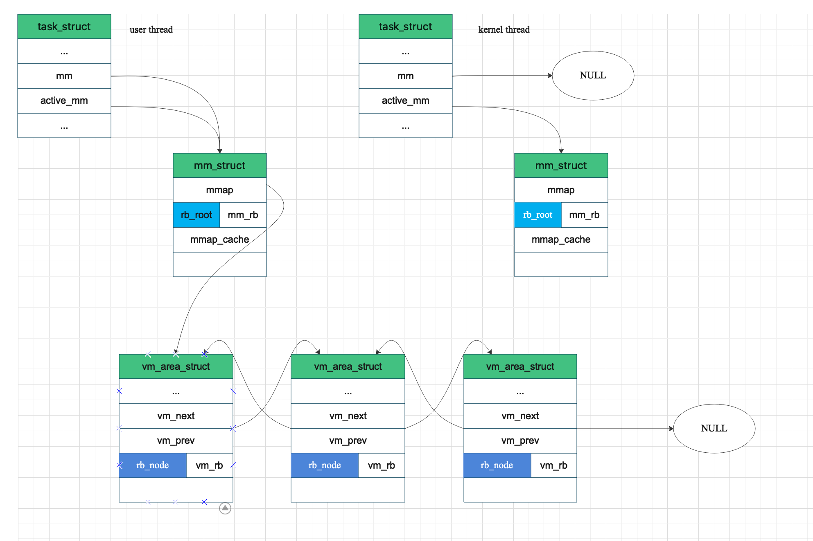

#### Website List
[kernel.org](https://www.kernel.org/doc/html/v4.16/index.html)

### Memory Management

#### Common senses

* Contiguous linear addresses within a page are mapped into contiguous physical addresses.

#### Comparisons

1. What's the difference between page and page frame?

> the former is just a block of data, which may be stored in any page frame or on disk. A page frame is a constituent of main memory, and hence it is a storage area.

2. Segment Selector vs. Segment Descriptor

> A logical address consists of two parts: a segment identifier and an offset that specifies the relative address within the segment. The segment identifier is a 16-bit field called the _Segment Selector_.
> Each segment is represented by an 8-byte _Segment Descriptor_ that describes the segment characteristics.

3. write-through vs. write-back

> _write-through_ is simpler, which write the cache block to the next lower leve imediately. While simple, write-through has the disadvantage of causing bus traffic with every write.
> _write-back_ defers the update as long as possible by writing the updated block to the next lower level only when it is evicted from the cache by the repalcement algorithm. It has the disadvantage of additional complexity.

#### Pages

> Most 32-bit architecutres have 4KB pages, whereas most 64-bit architectures have 8KB pages.
> `page` structure is associated with physical pages, not virtual pages. The data structure's goal is to describe physical memeory, not the data contained therein.

#### Zones

> Because of harware limitations, the kernel cannot treat all pages as identical. The kernel uses the zones to group pages of similar properties.
> The zones do not have any physical relevance but are simply logical groupings used by the kernel to keep track of pages.
> The kerenl has to deal with two shortcomings of hareware with respect to memroy addressing:
> * Some hareware devices can perform DMA (direct memroy access) to only certain memory address.
> * Some architectures can physically addressing larger amounts of memory than they can virtually address. Consequently, some memory is not permanently mapped into the kernel address space.
> 
> To cope above problems, Linux has four primary memory zones:
> * __ZONE_DMA__ - This zone contains pages that can undergo DMA.
> * __ZONE_DMA32__ - Like ZONE_DMA, this zone contains pages that can undergo DMA. Unlke __ZONE_DMA__, these pages are accessible only by 32-bit devices.
> * __ZONE_NORMAL__ - This zone contains normal, regularly mapped, pages.
> * __ZONE_HIGHMEM__ - This zone contains "high memory", which are pages not permanently mapped into the kernel's address space.
> 
> The zones on a x86 architecture are listed as follows. 
> 
> For x64 architecutre, it can fully map and handle 64-bits of memory, thus, x64 has no ZONE_HIGHMEM.
> 

#### Memory Address Space

#### Getting Pages
Flag | Description
-------|-----------------
`alloc_page(gfp_mask)` | Allocates a single and returns a pointer to its `page` structure
`alloc_pages(gfp_mask, order)` | Allocate $2^{order}$ pages and return a ponter to the first page's `page` structure 
`__get_free_page(gfp_mask)` | Allocate a single page and returns a pointer to is logical address
`__get_free_pages(gfp_mask, order)` | Allocates $2^{order}$ pages and returns a pointer to the first page's logical address 

#### gfp_mask Flags
> _gfp_ stands for `__get_free_pages()`.
> The flags are broken up into three categories: action modifiers, zone modifiers, and types. Action modifiers specify _how_ the kernel is supposed to allocate the requested memory. Zone modifiers specify from _where_ to allocate memory. Type flags specify a combination of action and zone modifiers as needed by a certain _type_ of memory allocation.

#### Others

1. MMU

> the memory management unit (MMU) that do the translation from virtual to physical address typically deals in page.
> 

2. Dynamic RAM (DRAM)

> DRAM stores each bit as charge on a capacitor. DRAM storage can be made very dense - each cell consists of a capacitor and a single access transistor.
> Various sources of leakage current cause a DRAM cell to lose its charge within a time period of around 10 to 100 milliseconds (it's enough for CPU). The memory system must periodically refresh every bit of meory by reading it out and then rewriting it.
> The cells (bits) in a DRAM chip are partitioned into _d supercells_, each consisting of _w_ DRAM cells. A _d_ * _w_ DRAM stores stores a total of _dw_ bits of information. The supercells are organized as a rectangular arrya with _r_ rows and _c_ columns, where _rc = d_.
> Information flows in and out of the chip via external connectors called _pins_. Each pin carries a 1-bit signal.
> Each DRAM chip is connected to some circuitry, known as the _memory controller_, that can transer _w_ bits at a time to and from each DRAM chip. To read the contents of supercell (i, j), the memory controller sends the row address _i_ (called a _RAS_, _row access strobe request_) to the DRAM, followed by the column address _j_ (called a _CAS_, _column access strobe request_). RAS and CAS requests share the same DRAM address pins.
> DRAM chips are packaged in _memory modules_ that plug into expansion slots on the main system board (mortherboard).

##### Reference
https://www.kernel.org/doc/html/v4.16/process/howto.html
