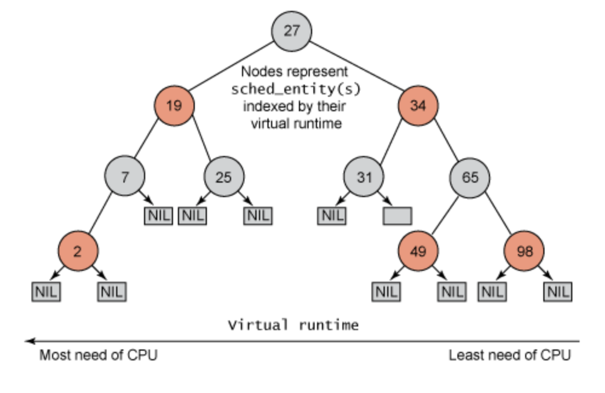

### Reading List

1. [CFS design](https://www.kernel.org/doc/html/latest/scheduler/sched-design-CFS.html)
2. [CFS rbtree](http://www.cs.montana.edu/~chandrima.sarkar/AdvancedOS/CSCI560_Proj_main/index.html)

### Question list

1. scheduler type

```Bash
more /sys/block/sdX/queue/scheduler
noop [dealine] cfq
```

What are these above separately?

2. What are the  purposes of these config options?

* CONFIG_PREEMPT_NONE
* CONFIG_PREEMPT_VOLUNTARY
* CONFIG_PREEMPT
* CONFIG_PREEMPT_RT

3. What's PREEMPT_RT?

4. What's scheduling class and How does it work?

see [this page](https://developer.toradex.com/knowledge-base/real-time-linux) for basic knowledge

### FAQ

1. [What are the differencies of __CONFIG_PREEMPT_NONE__, __CONFIG_PREEMPT_VOLUNTARY__ and __CONFIG_PREEMPT__](https://www.oreilly.com/library/view/mastering-embedded-linux/9781784392536/ch14s04.html)?

> * __CONFIG_PREEMPT_NONE__: no preemption
> * __CONFIG_PREEMPT_VOLUNTARY__: enables additional checks for requests for preemption
> * __CONFIG_PREEMPT__: allows the kernel to be preempted
>
> With preemption set to __none__, kernel code will continue without rescheduling until it either returns via as `syscall` back to user space where preemption is always allowed, or it encounters a sleeping wait which stops the current thread.
>
> The second option enables explicit preemption points, where the scheduler is called if the `need_resched` flag is set, which reduces the worst-case preemption latencies at the expense of slightly lower throughput.
>
> The third option makes the kernel preemptible, meaning that an interrupt can result in an immediate reschedule so long as the kernel is not executing in an atomic context.

A few comparisons of latency and throughput of these options can be found in [this blog](https://www.codeblueprint.co.uk/2019/12/23/linux-preemption-latency-throughput.html).

2. [How to check the target latency (minimum time slice) on a linux system](https://www.kernel.org/doc/html/latest/scheduler/sched-design-CFS.html)?

```Bash
cat /proc/sys/kernel/sched_min_granularity_ns
30000000
```

### Comletely fair scheduler (CFS)

#### Overview

> CFS basically model an "ideal, prescise multi-tasking CPU" on real hardware.
>
> "Ideal multi-tasking CPU" is a CPU that has 100% physical power and which can run each task at precise equal speed, in parallel, each at 1/nr_running speed.
>
> "Virual runtime" specifies when its next timeslice would start execution on the ideal multi-tasking CPU. In practicw, the virtual runtime of a task is its`actual runtime normalized to the total number of running tasks.

#### The rbtree


